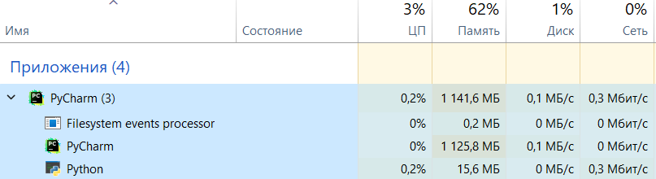

# Потоки и процессы

## IO-Bound:
###Время синхронной проверки ссылок:

###Время проверки ссылок, используя ThreadPoolExecutor:
5 воркеров:

10 воркеров:

100 воркеров:

При использовании многопоточности для выполнения данной задачи было замечены изменения только во времени выполнения работы программы. С увеличением воркеров программа начинала быстрее выполняться. Загрузка процессора, занимаемая программой оперативная память и нагрузка сети отличались не сильно и в среднем имели данные характеристики:

##CPU-bound:

(Так как в задаче генерация происходит за счёт бесконечного цикла, выполнением программы я считал генерация 3 монет и md5-hash)

###Время генерации монет с помощью 1 ядра:

###Время генерации монет, используя ProcessPoolExecutor

5 воркеров:

15 воркеров:

61 воркер (максимальное допустимое число для моего устройства, дальше программа начинала выдавать ошибку):

При использовании многопроцессорности была замечана более высокая производительность в сравнении с 1 ядром, однако между разным количеством воркеров результаты не сильно отличаются. В программе присутствуеют элементы случайности, благодаря чему программа с 5 воркерами может отработать быстрее чем с 61 воркерами. Можно предположить, что в среднем программа работает с равной скоростью с разным количеством воркеров и наращивать их количество бесполезно.

Загрузка процессора и оперативной памяти оставалась на одном уровне.